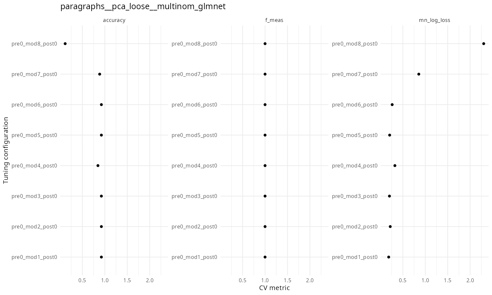
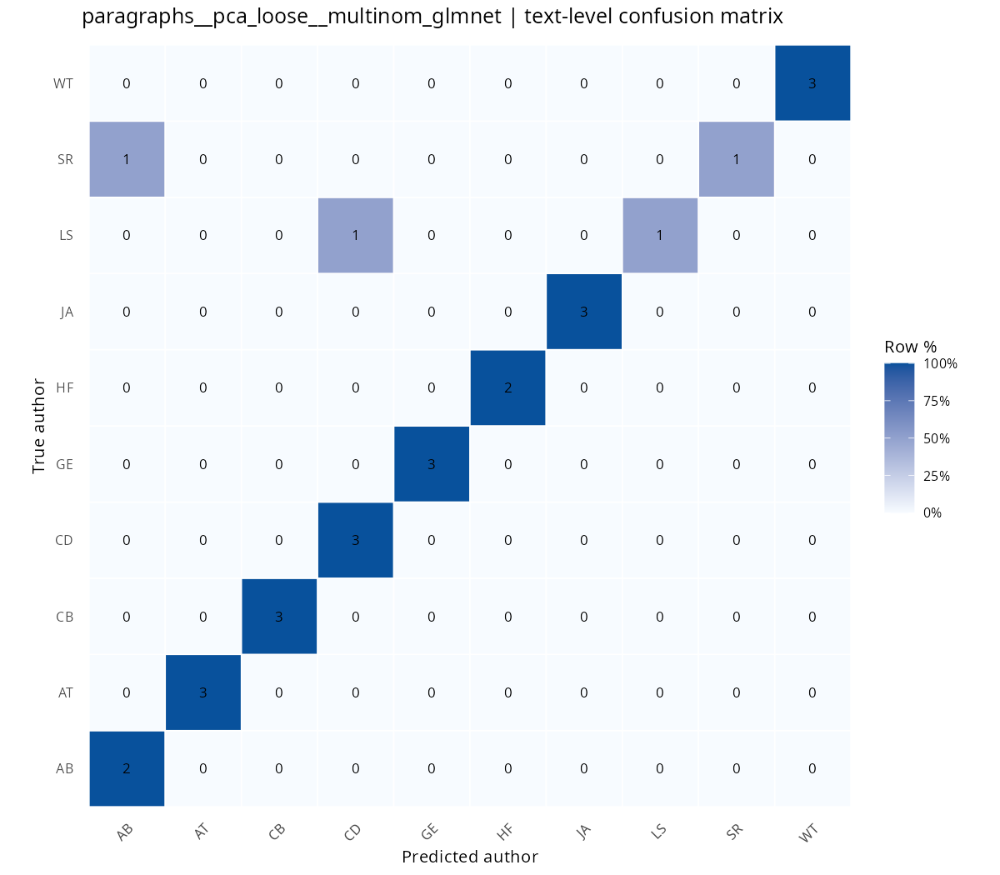
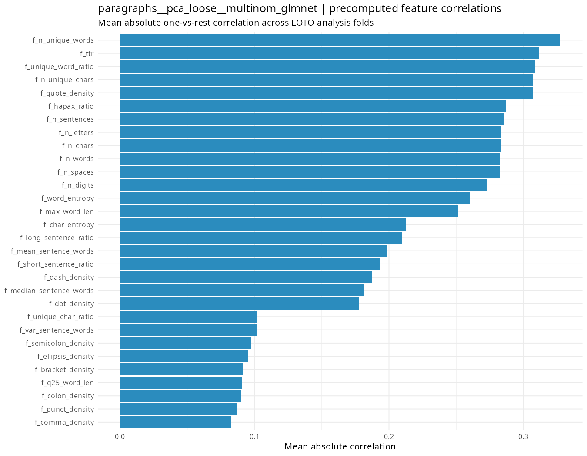

# RMulticlass

Проект строит пайплайн для определения автора английского художественного текста по его фрагментам. Основная идея: текст сначала очищается и разбивается на чанки, затем для каждого чанка строятся признаки, модели обучаются в схеме leave-one-text-out, а предсказания чанков агрегируются обратно в предсказание целого текста.

## Данные

Исходные тексты лежат в `british_fiction`, метаданные - в `metadata.csv`. В метаданных хранятся идентификаторы текстов, авторов, названия и имена файлов.

В пайплайн попадают только авторы, у которых есть минимум два текста. Это нужно, чтобы можно было честно откладывать один текст автора в тестовый фолд, а остальные оставлять в обучении. Иначе мы будем предсказывать не автора, а конкретный текст, будет утечка данных, что неприятно.

## Предобработка

На первом этапе тексты читаются из `british_fiction`, очищаются и сохраняются в `british_fiction_prepared` с теми же именами.

Очистка делает следующее:

- убирает технические заголовки и хвосты Project Gutenberg;
- нормализует кавычки, тире и пробелы;
- удаляет числа;
- делает лемматизацию.

Сюда вынесена очистка, она применяется к конкретным текстам, не фиттится ни на чём, соответственно, утечки нет.

## Чанкование

После подготовки тексты разбиваются на чанки. Все возможные схемы описаны в `config.R`, но реально используемые схемы задаются отдельно:

```r
enabled_chunk_names = c(
  "paragraphs",
  "ten_parts"
)
```

Сейчас считаются только:

- `paragraphs` - разбиение по абзацам;
- `ten_parts` - каждый текст делится на 10 примерно равных частей.

Для каждого набора чанков создается отдельная таблица в `chunk_tables/chunks`.

Почему так? Потому что пипелин очень долго считается и я не успел всё прогнать. Ради интереса оставлю после сдачи дз.

Произведён техничесчкий разведывательный анализ данных - результаты лежат в `chunk_tables/debug`
## Признаки

Для каждого чанка заранее считаются признаки `f_*`. Они не фиттятся, поэтому спокойно считаем вне CV (LOTO).

Среди них:

- длина чанка в символах, словах, предложениях и абзацах;
- число уникальных слов и символов;
- длины слова;
- признаки длины предложений;
- лексическое разнообразия, энтропия, как много стоп-слов;
- плотность пунктуации, кавычек, тире и других символов;
- доля заглавных букв.

Эти признаки сохраняются прямо в CSV с чанками.

## Текстовые признаки

Внутри рецептов дополнительно строятся текстовые признаки:

- триграммы слов;
- триграммы символов;
- фичи слов и стоп-слов.

Для признаков слов и символов используется TF-IDF. Для стопвордовых признаков используется TF.

Сейчас лимиты сделаны жесткими, чтобы ускорить подготовку:

```r
max_word_ngram_features = 150
max_char_ngram_features = 150
max_stopword_features = 50
```

## Отбор признаков

Сейчас используется только один вариант отбора:

```r
pca_loose
```

Перед PCA все числовые признаки нормализуются. После этого остается максимум 30 PCA-компонент.

Ранее в пипелине был корреляционный отбор, но сейчас он выключен, тк опять же, не успевает отсчитать.

## Балансировка и нормализация

Балансировка классов выполняется через апсемплинг внутри трейн-части каждого фолда. Тестовый текст в этот шаг не попадает.

Нормализация также выполняется внутри рецептов. Для PCA она применяется до расчета компонент.

## Модели

Проверяются несколько мультиклассовых моделей:

- multinomial glmnet;
- linear SVM;
- random forest;
- XGBoost;
- MLP.


## Leave-One-Text-Out

Оценка качества строится по схеме leave-one-text-out. В каждом фолде один полный текст откладывается в тест, а модель обучается на всех остальных текстах.

Это важно, потому что чанки одного текста не должны одновременно попадать и в трейн, и в тест. Иначе модель могла бы видеть похожие фрагменты того же произведения во время обучения.

Все обучаемые шаги рецептов - TF-IDF, PCA, нормализация, апсемплинг - фиттятся только на трейновой части фолда.

## Подбор гиперпараметров

Для каждой внешней конфигурации запускается перебор гиперпараметров. Размер сетки задается в `config.R`:

```r
grid_size = 8
```

Лучшая настройка гиперпараметров выбирается по `mn_log_loss`:

```r
selection_metric = "mn_log_loss"
```

Это сделано потому, что при leave-one-text-out macro F1 внутри отдельных фолдов может вести себя нестабильно. Log loss лучше подходит для выбора модели по вероятностям классов.

## Агрегация чанков в текст

Модель сначала предсказывает вероятности авторов для каждого чанка. Затем вероятности усредняются по всем чанкам одного текста. Итоговый автор текста - тот, у кого максимальная средняя вероятность.

## Метрики и графики

После каждого запуска сохраняются:

- строка с метриками в `metrics/model_runs.csv`;
- график tuning metrics в `metrics/plots`;
- confusion matrix в `metrics/confusion_matrices`;
- график корреляций заранее посчитанных `f_*` признаков в `metrics/feature_correlations`.

Основная итоговая метрика для сравнения моделей - text-level macro F1. Дополнительно сохраняются text-level accuracy, chunk-level macro F1, chunk-level accuracy и CV log loss.

## Воспроизводимость

В конфиге задан seed:

```r
seed = 22052026
```

Он используется при запуске моделирования. При параллельном выполнении отдельные модели могут давать небольшую недетерминированность, но общий пайплайн фиксирует зерно.

## Результаты

На текущий момент в `metrics/model_runs.csv` есть один актуальный завершенный прогон:

```text
paragraphs__pca_loose__multinom_glmnet
```

Это модель для чанков по абзацам, с PCA-отбором признаков и multinomial glmnet.

### Использованные признаки

Модель обучалась на 30 PCA-компонентах. Эти компоненты строились внутри каждого трейнового фолда после нормализации всех числовых признаков.

В PCA входили следующие группы признаков:

- `word trigrams TF-IDF` - TF-IDF по словесным триграммам, максимум 150 признаков;
- `character trigrams TF-IDF` - TF-IDF по символьным триграммам, максимум 150 признаков;
- `stopword TF` - частоты служебных слов, максимум 50 признаков;
- заранее посчитанные числовые признаки чанков `f_*`.

Список `f_*` признаков:

- `f_n_chars` - число символов;
- `f_n_letters` - число латинских букв;
- `f_n_digits` - число цифр;
- `f_n_spaces` - число пробельных символов;
- `f_n_lines` - число строк;
- `f_n_paragraphs` - число абзацев;
- `f_n_sentences` - число предложений;
- `f_n_words` - число слов;
- `f_n_unique_words` - число уникальных слов;
- `f_n_unique_chars` - число уникальных символов;
- `f_unique_word_ratio` - доля уникальных слов;
- `f_unique_char_ratio` - доля уникальных символов;
- `f_mean_word_len` - средняя длина слова;
- `f_median_word_len` - медианная длина слова;
- `f_min_word_len` - минимальная длина слова;
- `f_max_word_len` - максимальная длина слова;
- `f_var_word_len` - дисперсия длины слов;
- `f_q25_word_len` - первый квартиль длины слов;
- `f_q75_word_len` - третий квартиль длины слов;
- `f_mean_sentence_words` - среднее число слов в предложении;
- `f_median_sentence_words` - медианное число слов в предложении;
- `f_var_sentence_words` - дисперсия длины предложений;
- `f_short_word_ratio` - доля коротких слов;
- `f_long_word_ratio` - доля длинных слов;
- `f_short_sentence_ratio` - доля коротких предложений;
- `f_long_sentence_ratio` - доля длинных предложений;
- `f_ttr` - отношение числа уникальных слов к общему числу слов;
- `f_hapax_ratio` - доля слов, встретившихся один раз;
- `f_word_entropy` - энтропия распределения слов;
- `f_char_entropy` - энтропия распределения символов;
- `f_stopword_density` - доля служебных слов;
- `f_repeated_word_ratio` - доля повторов соседних слов;
- `f_punct_density` - плотность пунктуации;
- `f_dot_density` - плотность точек;
- `f_comma_density` - плотность запятых;
- `f_colon_density` - плотность двоеточий;
- `f_semicolon_density` - плотность точек с запятой;
- `f_question_density` - плотность вопросительных знаков;
- `f_exclamation_density` - плотность восклицательных знаков;
- `f_quote_density` - плотность кавычек;
- `f_dash_density` - плотность дефисов и тире;
- `f_bracket_density` - плотность скобок;
- `f_ellipsis_density` - плотность многоточий;
- `f_uppercase_ratio` - доля заглавных букв среди букв;
- `f_non_alnum_ratio` - доля небуквенно-цифровых символов.

Итоговые предикторы модели: `PC1` ... `PC30`.

### Модель и гиперпараметры

Использованная модель:

```text
multinom_glmnet
```

Лучшие гиперпараметры выбирались по `mn_log_loss`:

```text
penalty = 1e-10
mixture = 0.3214
best_config = pre0_mod1_post0
```

`penalty = 1e-10` означает почти отсутствующую регуляризацию. `mixture = 0.3214` задает смесь L1/L2-регуляризации в glmnet.

### Метрики


Текущие метрики:

| Метрика | Значение |
|---|---:|
| `cv_log_loss_mean` | 0.184 |
| `cv_macro_f1_mean` | 1.000 |
| `chunk_macro_f1` | 0.669 |
| `chunk_accuracy` | 0.235 |
| `text_macro_f1` | 0.899 |
| `text_accuracy` | 0.923 |

Такая схема оценки нормальна для этой задачи, потому что модель проверяется на полностью отложенном тексте. Чанки одного и того же текста не разлетаются между трейном и тестом, поэтому модель не видит фрагменты проверяемого произведения во время обучения.

### Графики

Tuning metrics:



Confusion matrix:



Корреляции признаков:



### Важность признаков
В PCA важность не считал (сложно интерпретировать), но в целом важность признаков посчитана (хотелось бы SHAP, но не успелось).
Вот так считается некоторая важность фич:
- для каждого фолда берется только трейновая часть. Для каждого признака считается абсолютная корреляция с каждым автором, затем эти значения усредняются по авторам и по фолдам. На графике показаны признаки с наибольшей средней абсолютной корреляцией. По описанию выше что за фичи что значат можно понять, что число уникальных слов оч сильно коррелирует, и в общем параметры, связанные с уникальными словами и символами довольно высоко в топе + выбивается количество цитат. Это можно назвать стилистическими особенностями, какие-то особенности языка автора и стиля написания.

Но опять же это не фактическая важность фич для моделей, а просто прикидка на корреляциях.

Хотелось бы какие-нибудь pos-фичи нагенерить и на них прогнать + темы и тп, но препроцессинг и так очень долгий, это проблема.

Если нужна одна хорошая модель для a-ля продакшена, можно взять конфиг из таблицы model_runs и обучить на всех текстах, качество мы приблизительно, хоть и немного оптимистично, посичтали (нельзя сделать nested_cv, и так некоторые авторы слишком мало раз представлены).

Основное ограничение, что мы выкинули Emily Bronte, но с ней ничего было нельзя сделать - мы бы могли ток этот конкретный текст предсказывать, ничего более, это неправильно. Опять же, можно какую-нибудь бинарную классификацию запилить типа это Эмили Бронте или нет, сделать простой ансамбль, но не хватило времени.

### Выводы
В целом, чанкование на абзацы и LOTO хорошо работают, мы уверены, что выделяем именно авторские особенности, а не шум. Мы берём стилистические фичи, можем довольно точно предсказывать автора по тексту. 

Пока писал текст, отсчиталось следующее разбиение на чанки (на 10 равных), результаты есть в табличке model_runs и корреляции под них там же.
Матрицы корреляций в той же папке где обычно. Цифры там гораздо приятнее)) Там macro accuracy 0.96, а macro f1 0.95. Как-то так, посмотрим, как досчитает, возможно, добавлю.
